# BulbaTech Innovations - DNS Tunneling & Pikabot Investigation

**Scenario:** The SOC at BulbaTech Innovations received an alert of abnormal traffic patterns and a high number of repeated DNS queries originating from endpoint `172.16.1.16`.

**Analyst Role:** SOC Analyst  
**Artifact:** `wireshark_challenge.pcap`  
**Tool:** Wireshark

---

## Executive Summary

Analysis of the packet capture revealed that endpoint `172.16.1.16` was compromised and actively communicating with malicious infrastructure. The endpoint downloaded a malicious PE32 executable disguised as an `image/gif` file from a known malware payload delivery host. The file was confirmed as **Pikabot** - a modular trojan - by 55 out of 67 security vendors on VirusTotal. Additionally, the endpoint exhibited DNS tunneling behavior, generating a high volume of TXT record queries to `*.h.dns.steasteel.net`, consistent with MITRE ATT&CK technique **T1071.004 - Application Layer Protocol: DNS**.

**Risk Rating:** 🔴 Critical

---

## PCAP Metadata

| Field | Value |
|-------|-------|
| Filename | `wireshark_challenge.pcap` |
| File size | 11 MB |
| First packet | 2023-05-17 17:32:04 UTC |
| Last packet | 2023-05-17 20:06:49 UTC |
| Elapsed time | 02:34:45 |
| Total packets | 39,106 |
| SHA256 (pcap) | `cde5c8ab5797894820b40a7f9038766863aa48c3f8614abe7b2b2d205a72863c` |

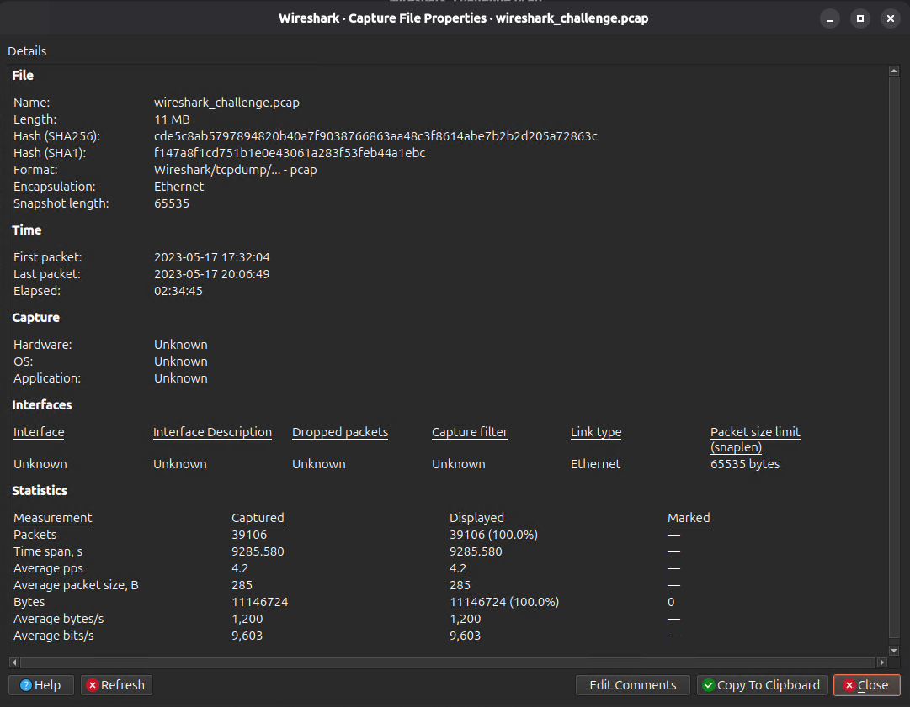

---

## Investigation Walkthrough

### Step 1 - Set Time Display to UTC

To correlate findings with threat intelligence and log sources, timestamps were converted to UTC format.

`View → Time Display Format → UTC Date and Time of Day`

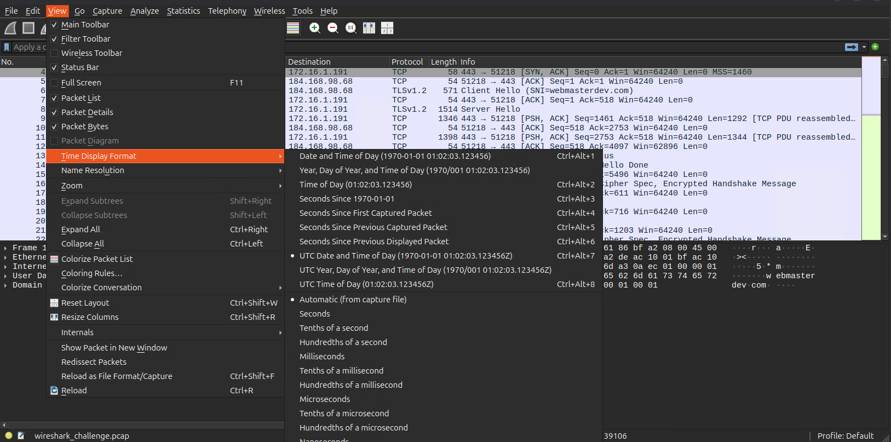

---

### Step 2 - First DNS Query

Filter: `dns`

The first DNS query in the capture originated from `172.16.1.191` (DNS server) to `172.16.1.16` (endpoint), resolving `webmasterdev.com` to `184.168.98.68`.

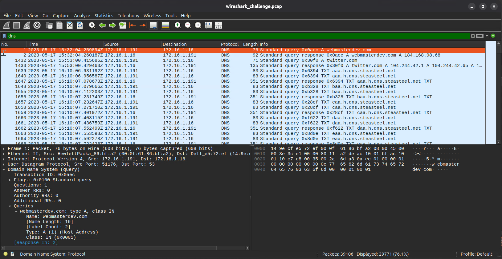
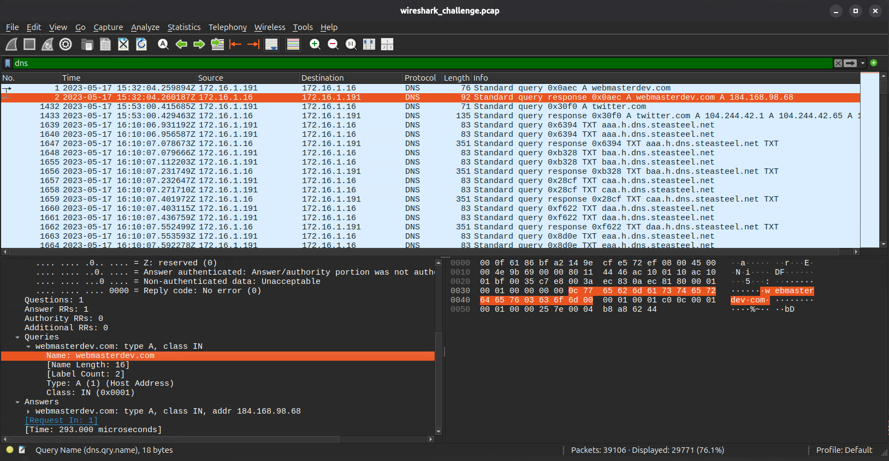

**VirusTotal — webmasterdev.com:** 8/92 vendors flagged this URL as malicious. URLhaus identified it as a malware payload delivery host.

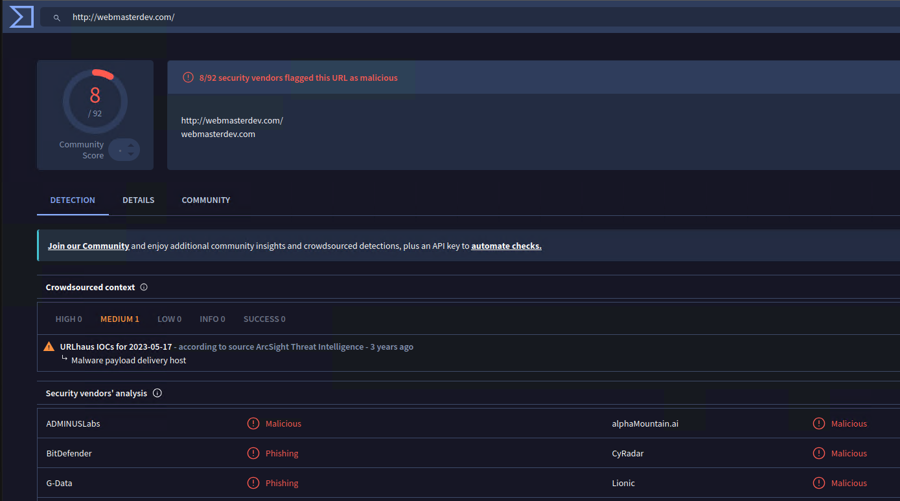

---

### Step 3 — HTTP Traffic Analysis

Filter: `http`

The endpoint sent an HTTP GET request to `162.252.172.54` requesting `/9GQ5A8/6ctf5JL`.

```
GET /9GQ5A8/6ctf5JL HTTP/1.1
User-Agent: Mozilla/5.0 (Windows NT; Windows NT 10.0; en-US) WindowsPowerShell/5.1.22621.963
Host: 162.252.172.54
```

The server responded with `HTTP/1.1 200 OK` delivering a file with `Content-Type: image/gif` - a classic polyglot file technique used to disguise malicious executables as image files.

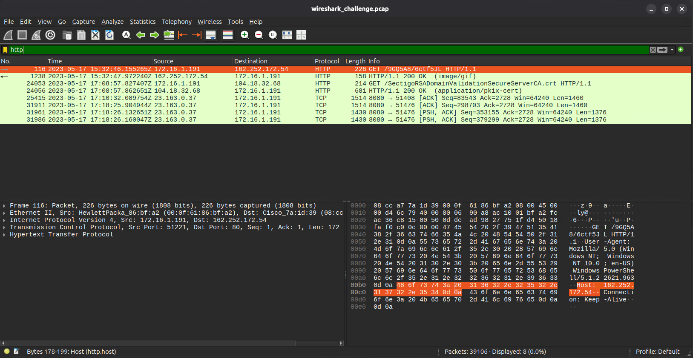
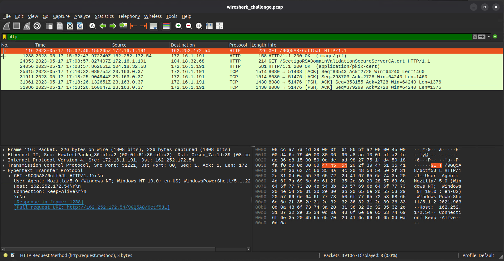
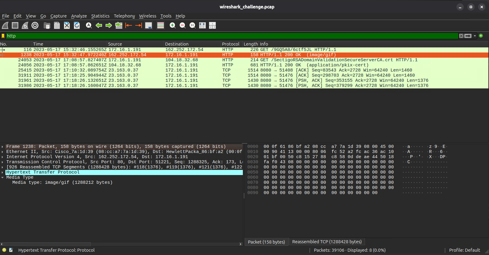

**VirusTotal - download URL:** 9/91 vendors flagged `hxxp[://]162[.]252[.]172[.]54/9GQ5A8/6ctf5JL` as malicious. Crowdsourced context confirmed activity related to **PIKABOT**.

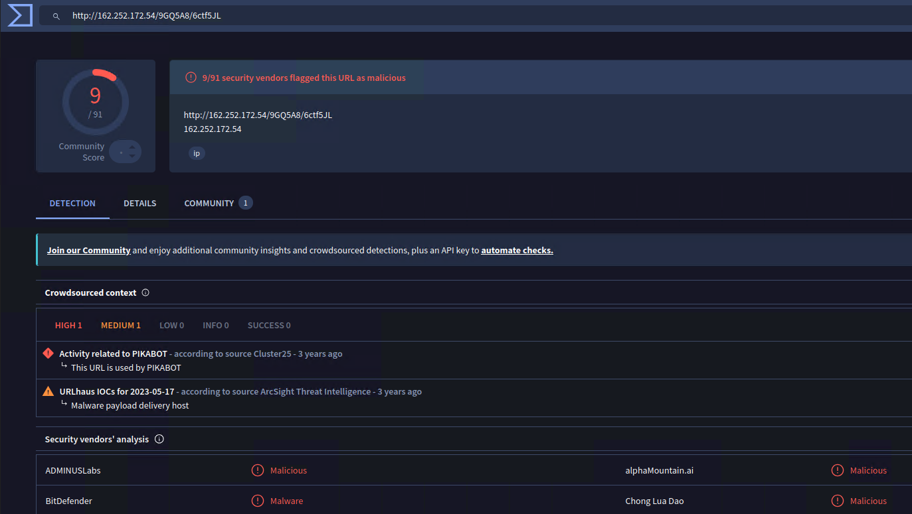

---

### Step 4 - File Export & Analysis

`File → Export Objects → HTTP`

The exported file `6ctf5JL` was listed as `image/gif` (1,288 kB) from `162.252.172.54`.

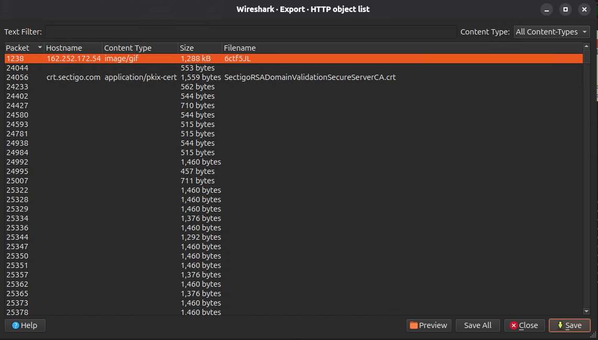

File identification via command line revealed the true nature of the file:

```bash
file 6ctf5JL
# 6ctf5JL: PE32 executable for MS Windows 6.00 (DLL), Intel i386, 6 sections

sha256sum 6ctf5JL
# 9b8ffdc8ba2b2caa485cca56a82b2dcbd251f65fb30bc88f0ac3da6704e4d3c6
```

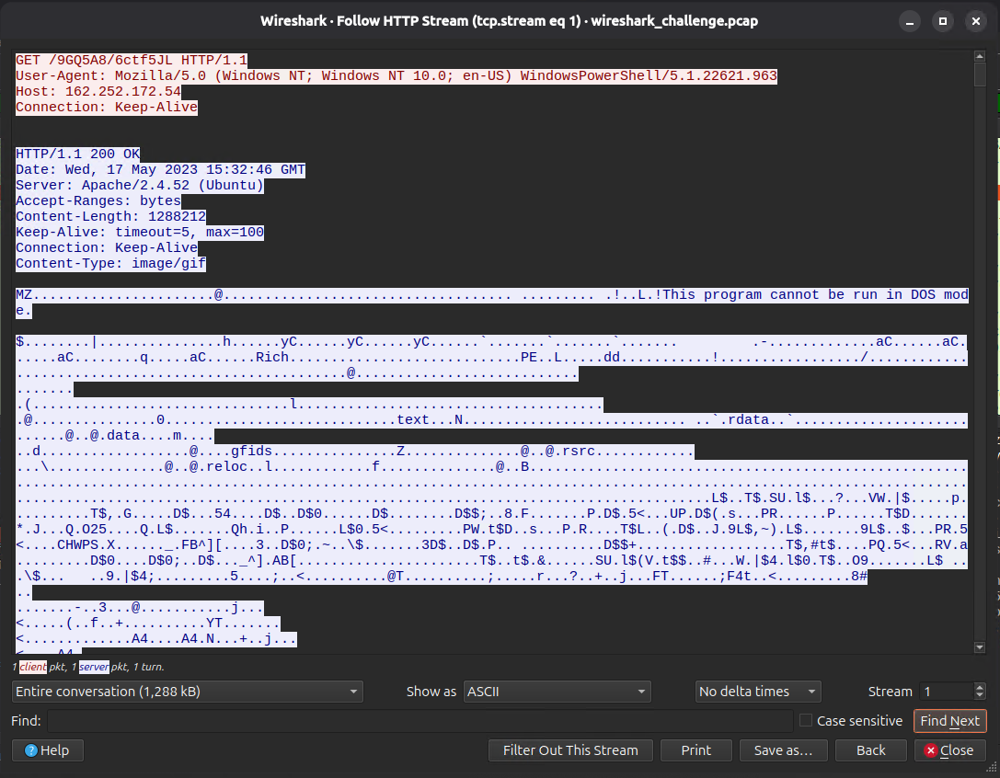
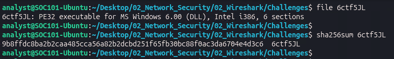
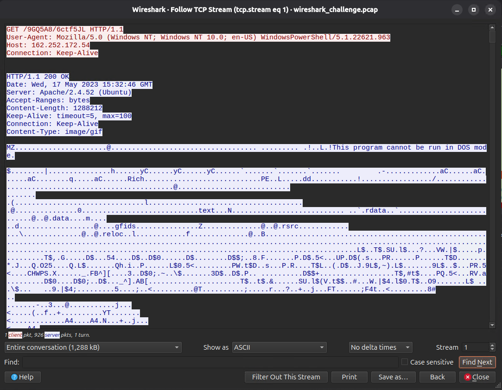

The magic bytes `4D 5A` (MZ header) confirm this is a Windows PE executable — not a GIF image.

**VirusTotal - SHA256:** 55/67 vendors detected the file as malicious.

- Popular threat label: `trojan.pikabot/mikey`
- Family labels: `pikabot`, `mikey`, `zenpak`
- Behaviors: `pedll`, `spreader`, `persistence`, `detect-debug-environment`

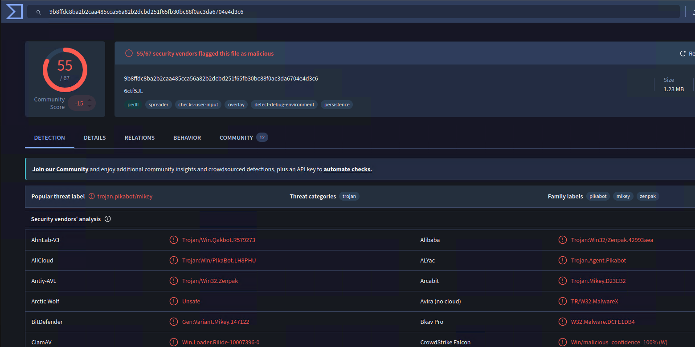

---

### Step 5 - Malware Identification

The downloaded file is **Pikabot** - a modular Windows trojan and loader active since 2023, known for delivering secondary payloads including Cobalt Strike, ransomware, and other post-exploitation tools.

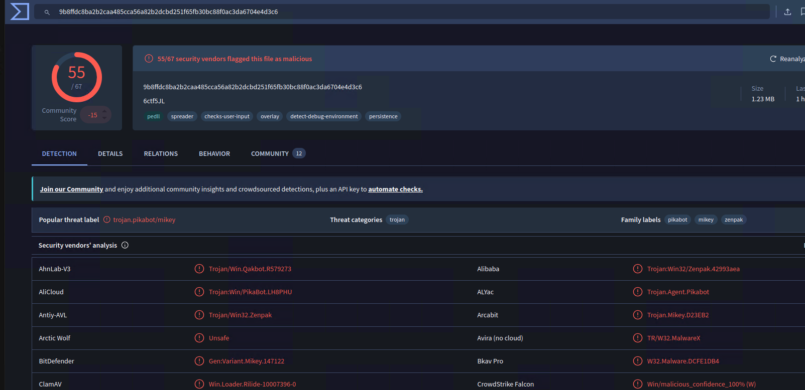

---

### Step 6 - DNS Tunneling (C2 via DNS)

Filter: `udp`

The majority of UDP traffic consisted of DNS queries. The endpoint generated a high volume of TXT record queries to subdomains of `steasteel.net` in a sequential pattern:

```
aaa.h.dns.steasteel.net
baa.h.dns.steasteel.net
caa.h.dns.steasteel.net
daa.h.dns.steasteel.net
eaa.h.dns.steasteel.net
faa.h.dns.steasteel.net
```

This sequential subdomain pattern is characteristic of **DNS tunneling** - data exfiltration or C2 communication encoded within DNS TXT record queries.

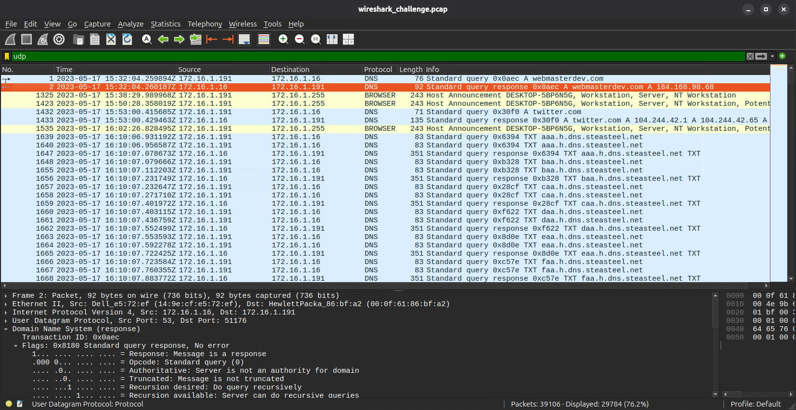
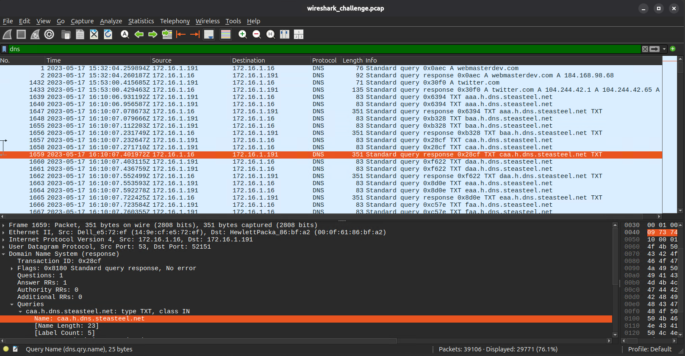

**VirusTotal — steasteel.net:** 4/92 vendors flagged this domain as malicious.


---

### Step 7 - MITRE ATT&CK Mapping

The DNS tunneling activity maps to **T1071.004 - Application Layer Protocol: DNS** under the Command and Control tactic.

> Adversaries may communicate using DNS to avoid detection by blending in with normal traffic. Commands and data are embedded within DNS TXT records.

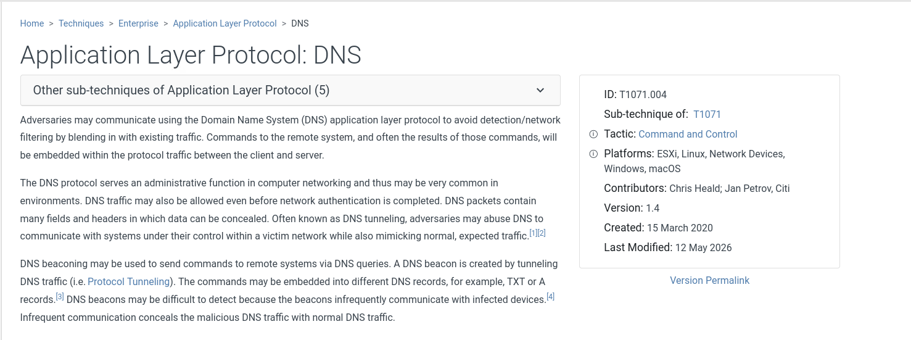

---

## Findings Summary

| # | Finding | Detail |
|---|---------|--------|
| 1 | Compromised endpoint | `172.16.1.16` |
| 2 | First DNS query | `webmasterdev.com` → `184.168.98.68` |
| 3 | Malicious download URL | `hxxp[://]162[.]252[.]172[.]54/9GQ5A8/6ctf5JL` |
| 4 | File disguise | `image/gif` (Content-Type) - actual PE32 DLL |
| 5 | File hash (SHA256) | `9b8ffdc8ba2b2caa485cca56a82b2dcbd251f65fb30bc88f0ac3da6704e4d3c6` |
| 6 | Malware identified | Pikabot (trojan.pikabot/mikey) - 55/67 VT detections |
| 7 | C2 protocol | DNS tunneling via TXT records to `*.h.dns.steasteel.net` |
| 8 | MITRE technique | T1071.004 — Application Layer Protocol: DNS |

---

## IOC Table

| Type | Value | Context |
|------|-------|---------|
| IP | `162.252.172.54` | Pikabot payload delivery server |
| IP | `184.168.98.68` | webmasterdev.com resolved IP |
| Domain | `webmasterdev[.]com` | Malware payload delivery host (8/92 VT) |
| Domain | `steasteel[.]net` | DNS tunneling C2 domain (4/92 VT) |
| URL | `hxxp[://]162[.]252[.]172[.]54/9GQ5A8/6ctf5JL` | Pikabot download URL (9/91 VT) |
| SHA256 | `9b8ffdc8ba2b2caa485cca56a82b2dcbd251f65fb30bc88f0ac3da6704e4d3c6` | Pikabot DLL (55/67 VT) |
| Filename | `6ctf5JL` | Disguised as image/gif - PE32 DLL |

---

## MITRE ATT&CK Mapping

| Technique | ID | Tactic |
|-----------|----|--------|
| Application Layer Protocol: DNS | T1071.004 | Command and Control |
| Masquerading - Match Legitimate Name or Location | T1036 | Defense Evasion |
| Ingress Tool Transfer | T1105 | Command and Control |

---

## Detection Opportunities

| Detection | Rule Logic |
|-----------|-----------|
| Pikabot payload delivery | Alert on HTTP GET requests returning `Content-Type: image/gif` with PE32 magic bytes `4D 5A` |
| DNS tunneling | Alert on >10 TXT record queries to same parent domain within 60 seconds |
| Suspicious PowerShell User-Agent | Alert on HTTP requests with `WindowsPowerShell` in User-Agent string |
| Known malicious domain | Block/alert on DNS queries to `steasteel.net` and `webmasterdev.com` |

---

## Incident Response Actions

1. **Isolate** endpoint `172.16.1.16` immediately
2. **Block** all IOCs at DNS, firewall, and proxy level
3. **Preserve** PCAP and endpoint memory image for forensic investigation
4. **Scan** environment for additional endpoints with DNS queries to `*.h.dns.steasteel.net`
5. **Review** PowerShell execution logs on affected endpoint
6. **Check** for lateral movement - Pikabot is known to deliver secondary payloads

---

## Tools Used

| Tool | Purpose |
|------|---------|
| Wireshark | PCAP analysis, protocol filtering, HTTP object export |
| `file` | File type identification via magic bytes |
| `sha256sum` | Hash computation for threat intelligence lookup |
| VirusTotal | IOC reputation - URL, file hash, domain |
| MITRE ATT&CK | Technique mapping |

---

*Investigation conducted in isolated SOC lab environment — VirtualBox NAT network, Ubuntu analyst VM.*

